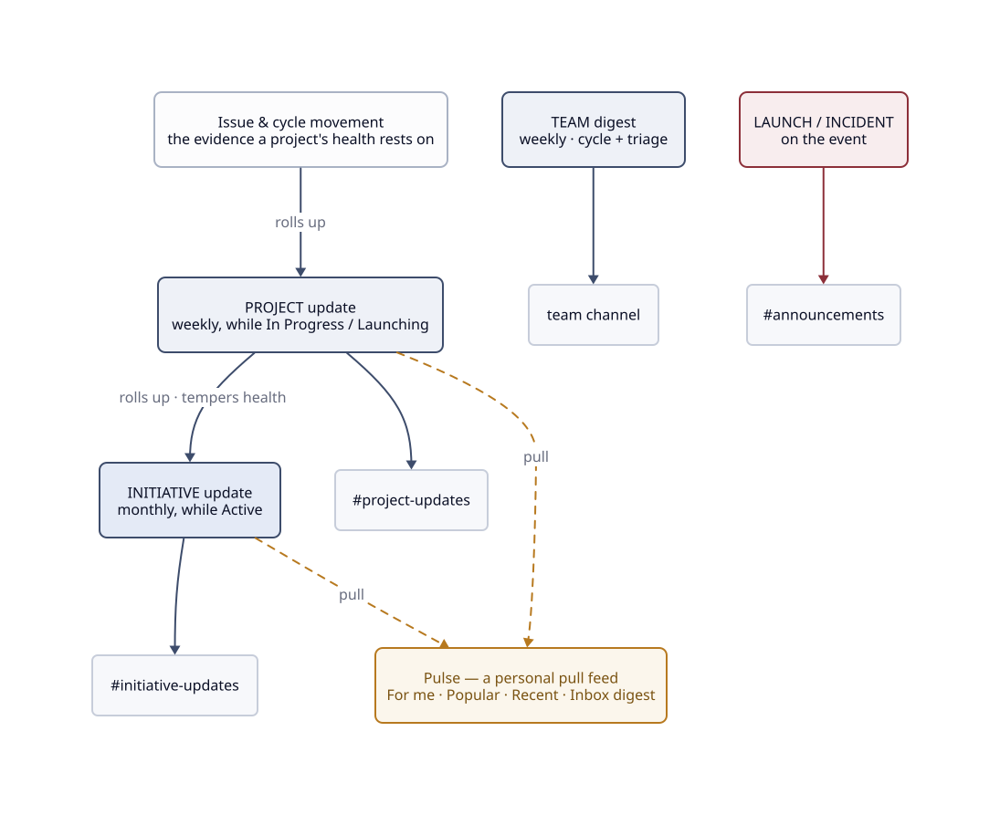

# :material-bullhorn: Communications

The single home for update cadence. Every rhythm in the model is stated here once, and the other
pages point back to it. The aim is that the right audience hears about KR movement, project
health and launches without asking, while nobody drowns in noise.

---

## The cadence

| What | Where | When | Whose job |
|---|---|---|---|
| **Initiative update** — KR movement, health, risks | `#initiative-updates` | **Monthly**, while Active | The initiative **owner** |
| **Project update** — what changed, health, risks | `#project-updates` | **Weekly**, while In Progress / Launching | The project **lead** |
| **Team digest** — cycle summary + triage digest | The team's channel | **Weekly** | The team |
| **Launches / incidents** | `#announcements` | On event | Whoever ships / responds |

The lead is responsible for their update happening. The skills draft it and the channel carries
it, but the obligation belongs to a person, by name.

Two things to read off the picture: a project update rolls up into its initiative's health, so
silence downstream tempers the story upstream; and the scheduled updates push to channels while
Pulse pulls the same updates into a personal feed.

### Making the cadence stick

The cadence doesn't live in anyone's memory. Three things keep it honest:

- Linear's native update reminders do the nudging. Configure them in workspace settings (weekly,
  at the day and time of your choosing) and leads of In Progress projects and owners of Active
  initiatives get the prompt; follow-up nudges arrive after 1 and 2 working days, and an overdue
  project shows **Update Missing** with its health icon greying as silence grows. Individual
  projects can override or opt out via the bell icon.
- The skills pre-gather the delta. [`linear-project-update`](skills/index.md) reads what moved
  since the last update, and [`linear-initiative-update`](skills/index.md) reads which feeding
  projects reported. Answering the reminder is verify-judge-post rather than archaeology, and a
  scheduled agent (say a weekly Claude Code routine invoking the update skill per In Progress
  project) can hand the lead a ready draft.
- Silence escalates. The [team digest](#the-cadence) and `task doctor` both flag stale updates
  (project over 10 days, initiative over 35), so a missed cadence shows up in the same views as
  any other drift.

---

## Health is a claim with evidence

Every update carries a health call (**on track · at risk · off track**), and the call is a claim
you can defend rather than a colour someone picked:

- A project's evidence is its issue and cycle movement, and the KR delta it's chasing.
- An initiative's evidence is its projects' weekly updates rolling up.

!!! warning "The roll-up dependency"
    Initiative updates depend on project updates. If a feeding project hasn't reported, or its
    update is stale, the initiative update says so and its health is tempered accordingly. A
    green initiative sitting on silent projects is a lie.

The standard formats live as templates beside the update skills:
[`linear-initiative-update`](skills/index.md) (KR movement table plus risks plus a
project-reporting note) and [`linear-project-update`](skills/index.md) (what changed, KR
progress, risks). Post via Linear's native status-update UI or let the skill draft and post for
you; both flow to the connected channel.

---

## :material-rss: Pulse — the pull surface

The cadence above is the push: accountable, scheduled updates. Linear **Pulse** is the pull, a
native feed of the workspace's project and initiative updates. It has a *For me* tab for work
you're involved in, plus *Popular* and *Recent*, with an optional daily or weekly digest
delivered to your Inbox (and audio playback, if you'd rather listen).

Use them together. Leads still post to the cadence, since Pulse has nothing to show without
those updates; everyone else catches up through [Pulse](https://linear.app/happydevs/pulse)
instead of scrolling channels. Pulse is available on all Linear plans. A workspace admin enables
it in Settings and sets the default digest cadence, and you subscribe to any project to pull it
into your feed.

---

## Keeping noise low

- One channel per audience, not per object: a single `#project-updates` for all projects, where
  people who need one project's detail follow it in Linear (or via Pulse).
- Channel messages come from the connected updates rather than ad-hoc posting, so the update
  *is* the message.
- Escalations and launches go to `#announcements` on the event itself. A channel that's quiet
  unless it matters stays read.

---

## Related

- [Initiatives](initiatives.md) · [Projects](projects.md) — where the updates are written
- [Teams, states & labels](teams.md) — the team digest's home ground
- [Skills](skills/index.md) — the update skills that draft to the standard formats
