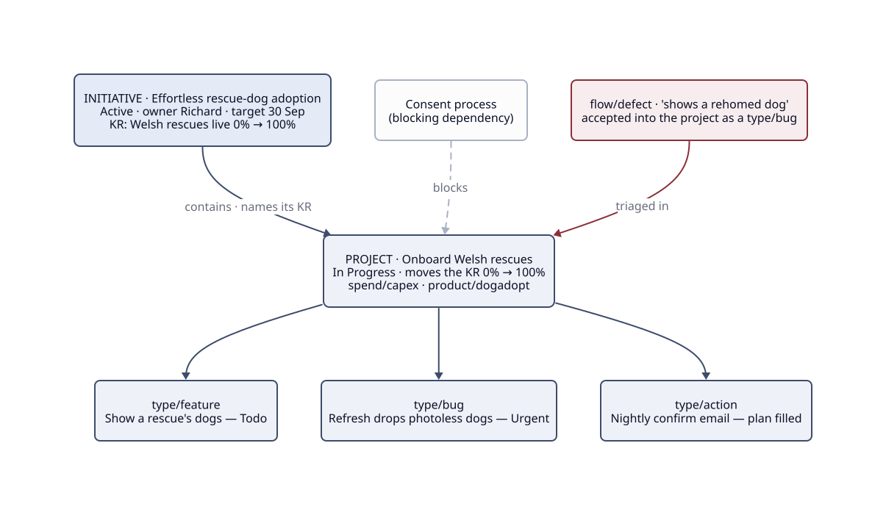

# :material-school: Worked example

One chain, end to end, in a real shape rather than a toy: the **dogadopt** product, from
strategic outcome down to a single picked-up issue, plus one inbound item arriving through
Triage. Every artefact below follows the live templates, and the native fields sit in the
comment above each body, exactly as the [skills](skills/index.md) set them.

That is the cheat-sheet model with real artefacts in place of the abstract boxes. Each one is
written out in full below.

---

## 1 · The initiative: the *what & why*, measured

Native fields: Owner Richard · Status `Active` · Target date 30 Sep 2026 ·
Slack `#initiative-updates` connected. The description body:

> ## Why this matters
>
> Finding a rescue dog in the UK means trawling dozens of rescue websites that don't talk to
> each other. Adopters give up and dogs wait longer. One place to search every rescue changes
> both.
>
> ## Key Results
>
> ### Measured
>
> | Key Result | Baseline | Target | Evidence |
> |---|---|---|---|
> | ADCH-registered Welsh rescues live in the portal | 0% | 100% | Coverage report (TBD, a dependency) |
> | Monthly active users searching dogs | 0 | 100/month | Plausible dashboard |
> | Outbound click-throughs to a rescue per month | 0 | 1 | Click tracking (TBD) |
>
> ## Out of scope
>
> Completed-adoption tracking (it happens on the rescue's side); rescues outside Wales this
> quarter.
>
> ## Context
>
> Consent from each rescue is part of the bar. Scraping without it is a relationship and legal
> risk, so onboarding includes a consent step.

Rule 1 ✓ (KRs declared, measured, with evidence sources; two are marked TBD, which is a
dependency rather than a pass). Rule 4 ✓ (one owner). Rule 5 ✓ (target date set).

---

## 2 · The project: the *how*, promising a delta

Born as a project in `Idea` ("could we aggregate Welsh rescues?"), it graduated at the
`Planned` gate under the initiative above. Native fields: Lead Richard · Status
`In Progress` · Dates 11 Aug → 12 Sep 2026 · Priority High · Labels
`spend/capex` + `product/dogadopt` · Milestones "First rescue live", "All 12 consented" ·
Slack `#project-updates` connected. The body:

> ## What we're doing and how
>
> Onboard every ADCH-registered Welsh rescue: obtain consent, ingest their available dogs
> via feed or manual entry, refresh at least weekly, and show them in the portal search.
>
> ## Key Results it moves
>
> | Initiative | Key Result | Delta (baseline → target) |
> |---|---|---|
> | Effortless rescue-dog adoption | Welsh rescues live in the portal | 0% → 100% |
>
> ## Out of scope
>
> Non-ADCH rescues; England/Scotland; adopter accounts.
>
> ## Context
>
> 12 rescues on the ADCH register at last count; the denominator may move, so recount at each
> update.

Rule 2 ✓ (KR + delta named). Dependencies: it's **Blocked by** the *Consent process* project,
drawn as a [native relation](projects.md#dependencies-native-never-prose), visible on the
timeline.

---

## 3 · Three issues under it

A `type/feature`, *"Show a rescue's dogs on the search page"*: user value in the Why,
acceptance criteria listing the observable behaviours, `product/dogadopt` inherited. It sits in
`Todo`, refined.

A `type/bug`, *"Refresh job drops dogs with no photo"*: steps to reproduce, expected vs actual,
impact ("listings shrink silently, a trust risk"). It's `Urgent`, picked up next.

A `type/action`, picked up, with its Plan filled. At capture the body was the prompt (What / Why
/ When it's done). At pickup the assignee added the plan, so the approach is reviewable before
the code:

> ## What needs doing?
>
> Nightly job emailing each consented rescue a link to confirm their listings are current.
>
> ## Why does it need doing?
>
> "Live" only counts if refreshed; stale listings break the coverage KR's definition.
>
> ## When is it done?
>
> Every consented rescue gets the nightly mail, and a bounce or 14-day silence flags the rescue
> as stale in the coverage report.
>
> ## Context
>
> Rescues asked for email over a portal login, so meet them where they are.
>
> ## Plan
>
> Cloudflare Worker cron 02:00 → for each consented rescue, send confirm-link (Email
> Service) → confirmation hits a Worker route stamping `last_confirmed` → coverage report
> reads the stamp. No login needed; link is signed, 14-day expiry.

All three satisfy rule 3 ✓ (in the project, one `type/*`, no `flow/*`).

---

## 4 · One inbound item, received through Triage

An email arrives: *"Your site shows a dog we rehomed last week."* Whoever's on
[triage duty](issues/triage.md) captures it into **Triage** and decides within the clock:

- Kind: `flow/defect`, a fault reported from outside any project's scope.
- Outcome: accept into a project. It's the refresh pipeline's bug, so it becomes a `type/bug`
  in the onboarding project and the `flow/*` label comes off (rule 3, never both).
- Priority: High, a trust issue rather than an outage. An outage would be `flow/incident`,
  decided immediately.

Had it been an ad-hoc data ask ("how many collies are listed in Powys?") it would stay flow
work: `flow/query`, no project, decided within 2 working days.

---

## What the example shows

The ladder holds intact. The nightly-confirm action serves the coverage KR's freshness bar, the
project promises that KR 0% → 100%, and the initiative measures why anyone cares. Ask "why am I
doing this?" at any rung and the answer is one hop up.

## Related

- [The Cheat Sheet](index.md) — the model this walks through
- [Initiatives](initiatives.md) · [Projects](projects.md) · [Issues](issues/index.md) — the standards each artefact follows
- [Glossary](glossary.md) — any term above, one line each
