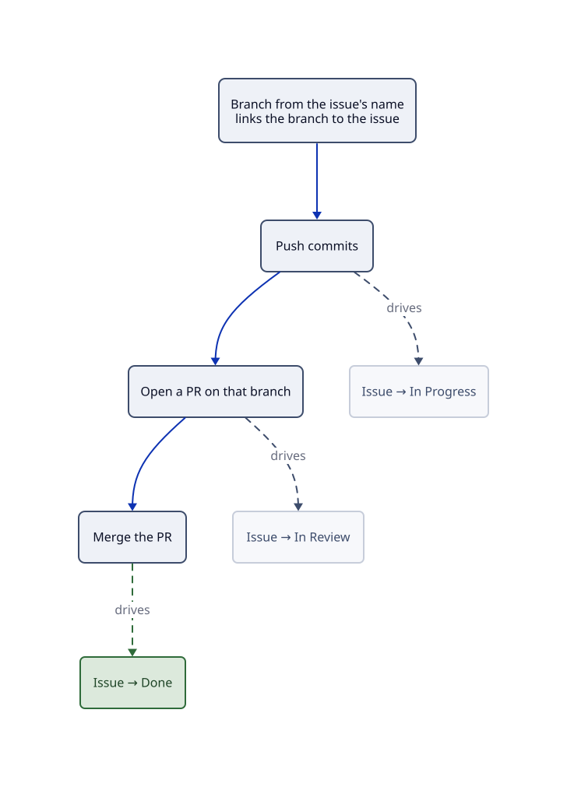

# :material-connection: Integrations

Linear only reflects reality if it's wired to where work and conversation actually happen. Two
integrations carry the model. **GitHub** keeps issue state in sync with code, and **Slack**
carries the [cadence](communications.md). Both are configured once in
[Linear settings → Integrations](https://linear.app/happydevs/settings/integrations).

---

## :material-github: GitHub, connected

The GitHub integration is live in `happydevs`, linked to the
[hungovercoders](https://github.com/hungovercoders) org. The loop runs per issue:

1. Take the branch name from the issue. Every issue carries a git branch name (`Cmd/Ctrl`
   `Shift` `.` to copy), and branching with it links the branch, and everything that follows,
   to the issue automatically.
2. The PR tracks the issue. Opening a PR on that branch attaches it, and Linear's state
   automation moves the issue (branch pushed → **In Progress**, PR opened → **In Review**,
   PR merged → **Done**). Configure the exact mapping per team in
   [team settings → Workflow](https://linear.app/happydevs/settings/teams).
3. Magic words work too. A PR description containing *Fixes GRI-123* or *Closes GRI-123* links
   and closes the issue on merge, for work that didn't start from the branch name.

The upshot is that nobody moves issue states by hand for code work. The state is a side effect
of shipping.

---

## :material-slack: Slack, to connect

Slack carries the [communication cadence](communications.md); the wiring is per-channel:

| Channel | Carries | Wired how |
|---|---|---|
| `#initiative-updates` | Monthly initiative updates | **Connect the channel on each initiative** — updates post automatically |
| `#project-updates` | Weekly project updates | **Connect the channel on each project** — same mechanism |
| `#announcements` | Launches & incidents, on event | Posted by whoever ships/responds — no automation needed |
| Team channels | The weekly [team digest](communications.md) | Posted by the team (or a scheduled agent) |

**Noise conventions** keep the integration carrying updates rather than everything:

- Channel messages come from status updates, not per-issue activity, so nobody gets a Slack
  ping for every state change. Per-issue notifications stay personal (your Linear Inbox, or
  Slack DMs if you opt in).
- One channel per audience, not per object: projects share `#project-updates`, and you follow
  an individual project in Linear (or [Pulse](communications.md)) for more.
- If a thread starts in Slack, the decision goes back onto the issue. Slack is where
  conversation happens, Linear is where it's remembered.

!!! warning "Setup still needed"
    The Slack integration isn't connected yet. Enabling it is a one-time OAuth in
    [settings → Integrations](https://linear.app/happydevs/settings/integrations), after which
    you connect the two shared channels to their initiatives and projects as they're created.
    **Linear Asks** (create issues from Slack requests) is Business/Enterprise, so it isn't
    available on the current plan; requests arrive via [Triage](issues/triage.md) instead.

---

## Related

- [Communications](communications.md) — the cadence these channels carry
- [Issues](issues/index.md) — the branch-name convention starts at the issue
- [Triage work](issues/triage.md) — where inbound lands without Asks
