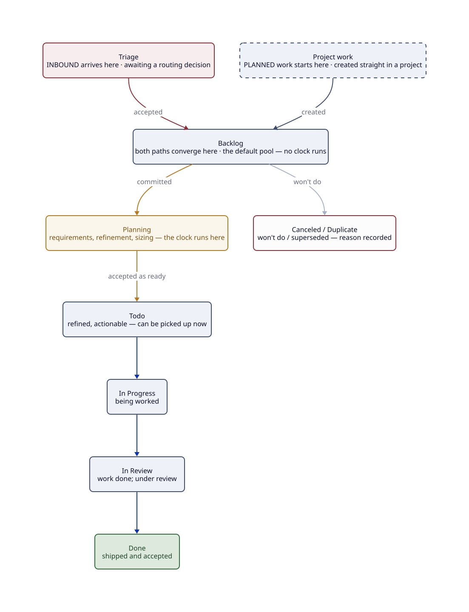

# Work

For anyone who touches the work itself. Work you do is tracked in
[Linear](https://linear.app/happydevs/team/GRI/all) as an **issue**: the representation of one
discrete piece of work, understood before it starts. Every issue is one of two kinds, **project
work** that moves a Key Result or **inbound work** that arrived through Triage. This page is
what's true of every issue whichever kind it is; the two kinds have a page each below.

[Every issue in Linear sits on one screen.](https://linear.app/happydevs/team/GRI/all) Same
tool as the strategy above it, with no boundary between *why* and the task in your cycle.

---

## :material-checkbox-marked-circle-outline: What an issue is

An issue is how a piece of work is represented: small enough for one person to pick up and
finish, clear enough that "done" isn't ambiguous, and understood before it starts. Two things
are true of every issue, whichever path it arrived on:

- **It's classified**: in a project *or* carrying exactly one `flow/*` label, never both,
  never neither ([rule 3](../hard-rules.md)). An issue that is neither is *unclassified*:
  invisible work.
- **Its body is the prompt**: the description says what to do and what "done" means, well
  enough that a person *or an agent* can act on it (the [agent-plan convention](#the-body-is-the-prompt)
  below). It carries a priority (Urgent → Low) that orders it.

Keep the issue about *the task*: the *why* belongs to the [initiative](../initiatives.md), and
the *what & how* to the [project](../projects.md) above it.

---

## :material-timer-sand: The shared lifecycle

Every issue moves through the same states, whichever path it came from:

| State | Means |
|---|---|
| Triage | In **Linear's built-in Triage inbox**; awaiting a routing decision (see [Triage work](triage.md)) |
| Backlog | The default pool — captured or accepted, **no commitment to plan it yet**; no clock runs here |
| Planning | **Committed to work up** — requirements gathering, refinement and sizing happen here, and the clock runs |
| Todo | **Refined, actionable, can be picked up now** |
| In Progress | Being worked |
| In Review | Work done; under review |
| Done | Shipped and accepted |
| Canceled | Won't do; reason recorded |
| Duplicate | Superseded by another issue |

### Backlog, Planning, Todo — commitment, then readiness

Two transitions here carry the model's weight, and they mean different things.

- Backlog → Planning is a *commitment decision*. The team has agreed to work the item up.
  Anything still in Backlog is honestly parked: captured or accepted, but nobody has promised to
  refine it, so no clock runs and no one need apologise for its age.
- Planning is where refinement is *visible work*: sharpen the problem, gather requirements,
  define what "done" is, size it, clear blockers. Because commitment has been made, time spent
  here is measured — a growing or ageing Planning column is the evidence that refinement is the
  constraint (see [Flow](../flow.md)).
- Planning → Todo is the *readiness gate*. The refinement has been accepted: someone can pick
  the issue up and start without going back to ask what it means.

Nothing starts from Backlog or Planning. That gate is what keeps *In Progress* honest, because
everything in it was understood before it began.

---

## :material-robot-outline: The body is the prompt

An issue's description is written to be acted on directly, by a person or an agent. That's the
*agent-plan convention*, and it splits into two moments:

- **At capture**, the body is the prompt. State the problem and what "done" looks like clearly
  enough that the reader needs nothing else to start. Write it for whoever, or whatever, picks
  it up. This is all the creation step does: get the task down.
- **At pickup**, store the plan against the issue. *Later*, when the issue is picked up and an
  agent (or a person) works out *how*, that plan is captured in the issue's `## Plan` section
  (left empty at creation), so the approach is reviewable before the code is, and the issue
  stays the single record of the task.

Keep the two apart. Capturing an issue is *getting it down*; planning the how happens when it's
picked up.

---

## :material-table: Native fields, not prose

Everything Linear models as a field is a native field, never text in the description. The same
holds on both paths:

| Native field | Set to |
|---|---|
| Assignee | The one person doing it |
| Priority | Urgent → Low |
| Status | The lifecycle state above |
| Project **or** `flow/*` | The classification (rule 3) — one, never both |
| Links | Resources (docs, designs, logs, prior art, related issues) attached, not pasted into the body |

The kind-specific labels (`type/*`, `product/*` for project work; `flow/*` for triage) are on
the two pages below. The description carries only the *what / why / when*, any *context*, and,
later, the *plan*: that's the template, and the [`linear-issue`](../skills/index.md) skill fills
it.

---

## :material-directions-fork: Which work is it?

Every issue is exactly one of two kinds, set by how it's classified ([rule 3](../hard-rules.md)).
Pick your path; each page is written for the people who live on it:

-   :material-clipboard-check-outline: **[Project work](project-work.md)**

    ---

    Planned work that sits in a project and traces to its Key
    Result. `type/*` + `product/*` labels, a priority, and a template per type.

    For delivery teams. [:octicons-arrow-right-24: Project work](project-work.md)

-   :material-bell-ring-outline: **[Triage work](triage.md)**

    ---

    Inbound work that arrived, on one `flow/*` label, no
    project. Where inbound work enters, the five outcomes, and the two SLA clocks.

    For the triage rota. [:octicons-arrow-right-24: Triage work](triage.md)

---

## Related

- [The Hard Rules](../hard-rules.md): rule 3 (every issue classified)
- [The Cheat Sheet](../index.md): the one-page summary this expands
</content>
